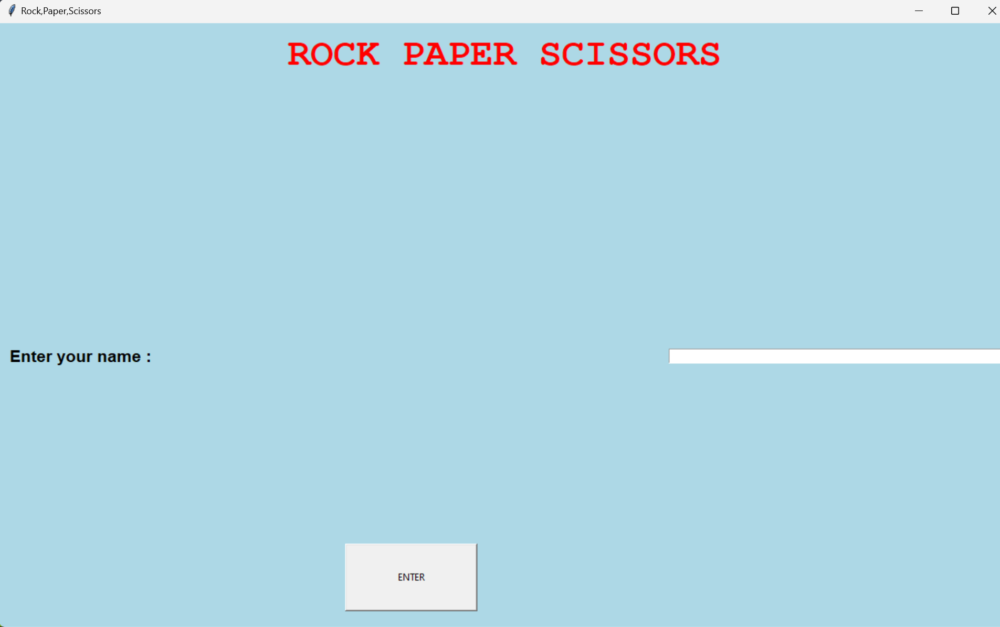
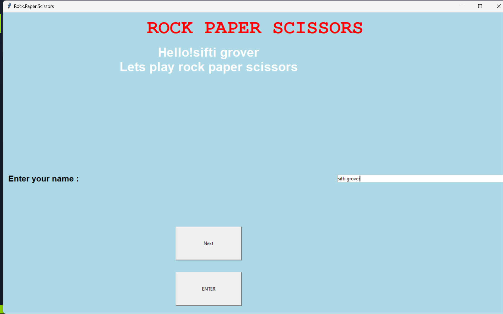
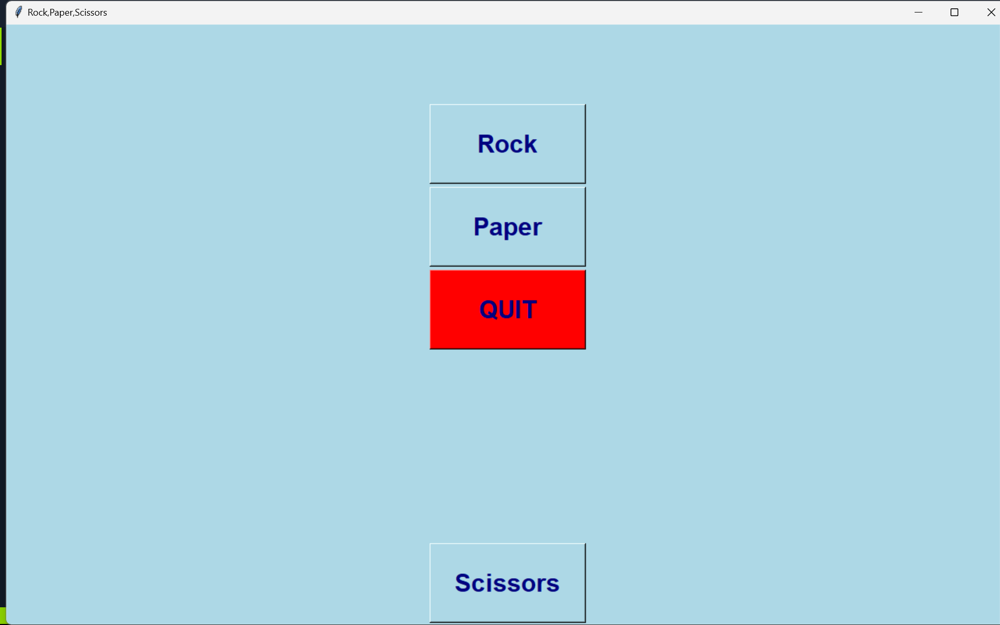
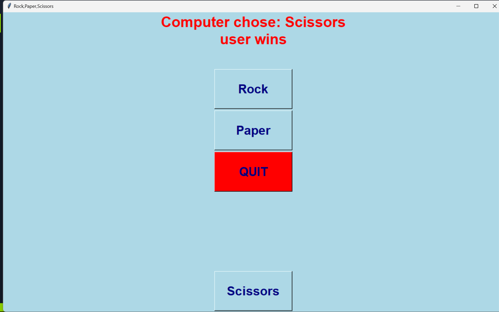
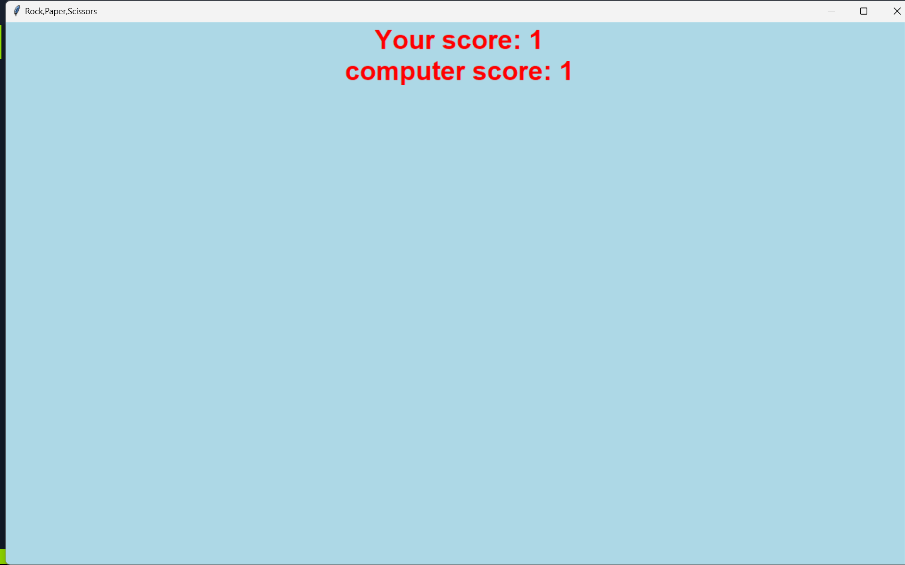

# Rock-Paper-Scissors Game 

This is a graphical Rock-Paper-Scissors game created with Python using the Tkinter library. The game lets users play against the computer and keeps track of scores for both the user and the computer.

## Features
- Interactive GUI with Tkinter
- User can input their name for a personalized experience
- Rock, Paper, Scissors buttons to make selections
- Displays computer's choice and game result
- Tracks and displays the scores for both the user and the computer
- Option to quit the game and view final scores

## Installation
1. Make sure you have Python 3 installed.
2. Install the required library:
   ```bash
   pip install tk

## How to Run
1. Clone the repository :
   ```bash
   git clone <https://github.com/sifti-grover/rock-paper-scissors>
3. Navigate to the project directory :
   ```bash
   cd rock-paper-scissors
5. Run the script:
   ```bash
   python rock_paper_scissors.py

## Gameplay Instructions
1. Enter your name in the first screen and click ENTER to start the game.
2. On the next screen, choose Rock, Paper, or Scissors to make a move.
3. The computer will randomly select one of the three options, and the game will display the result of each round.
4. Click QUIT to end the game and view the final scores.

## Code Overview
- show_frame(): Function to navigate between frames in the Tkinter GUI.
- determineWinner(): Logic to determine the winner based on the player's and computer's choices.
- rps(): Handles the game logic, generating computer's choice, and calling the winner function.
- quit(): Ends the game and displays the final scores.

## Future Improvements
- Add animations and sound effects.
- Option to reset the game without quitting.
- Multiplayer mode to allow two players to play.

## Screenshots






## Enjoy the game!


